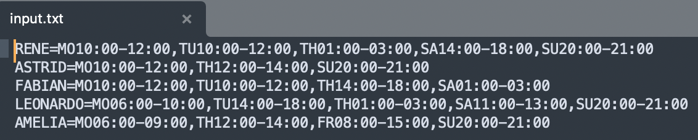
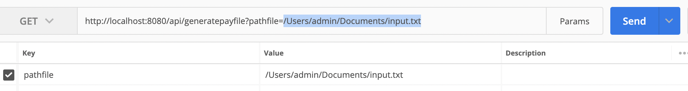
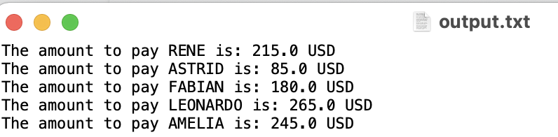

# PayEmployeSpring

Spring project to calculate the payment of hours you work. Design Patterns used are Stratategy Pattern and Factory Method
The microservices architecture was used to structure this project

1.  Configuración de POM
2.  Archivo `application.properties`

## Structure of Proyect

Make the structure of the project following the architecture of microservices where:
1. It consists of building an application as a set of small services, which are executed in their own process and communicate with lightweight mechanisms. Each service is responsible for implementing a complete functionality of the business. Each service is deployed independently
2. Algo use MVC architecture to keep configuration and utilities classes separate according to their package
3. Description:
     1. **Repository:** the DAO data query. It was not used in this project.
     2. **Entities:** The models mapped from the database. In this project it was not used
     3. **Controller:** The classes that contain the methods that will be in charge of processing the requests.
     4. **Service:** In charge of business logic.
     5. **Config:** Project settings.
     6. **Utils:** The utility classes that will be used throughout the project.
    

### Implementation of The Strategy and Factory Patterns

>  The Strategy pattern allows us to dynamically swap out algorithms at runtime, and the Factory pattern is a creational pattern which allows us to create objects as needed.

2.   **Strategy Pattern:** It was implemented in this clases com.falpema.payEmploye.service.PayCalculationStrategyImpl.java .
3.   **Factory Patterns:** It was implemented in this clases com.falpema.payEmploye.service.PayCalculationStrategyFactory.java .

## Running the project locally 

* To get started, clone this repo and run in your local spring IDE enviroment.
* Steps:

    1. git clone  **https://github.com/falpema/pay-employe-spring.git**. 
    2. Import this proyect in your SpringToolSuite
    3. Run as Spring Boot App.
    4. Create file input.txt with this format:
    
    4. To locally consume the rest service :  uri: http://localhost:8080/api/generatepayfile?pathfile=input.txt , for example you can use Postman in the parameter pathFile you have to pass the url of file with enter to Process , **http://localhost:8080/api/generatepayfile?pathfile=/Users/admin/Documents/input.txt**
    
    5. Finally an output file will be generated in the same path of the input file but with the name **output.txt** .
    

## Unit Tests
*To run the tests, run CalculatePayControllerTest.java .

* See the example test in **src/test/java/CalculatePayControllerTest.java** for an example of a component test.

## Types of Web Services REST used:

* GET: It is used to "retrieve" specific information from the server. It is also an idempotent and safe operation. Idempotent means that no matter how many times we call this operation, the result (which we will observe as users).

## Release History

* 0.0.1
    * DEFINICION DE ESTRUCTURA Y CONFIGURACIÓN: Se crea el proyecto de ejemplo
    * Date: 18/05/2022
    * Autor: Fpenaloza

    * Work in progress

## Información

–  [falpema.](https://github.com/falpema)
# # PayEmployeSpring

